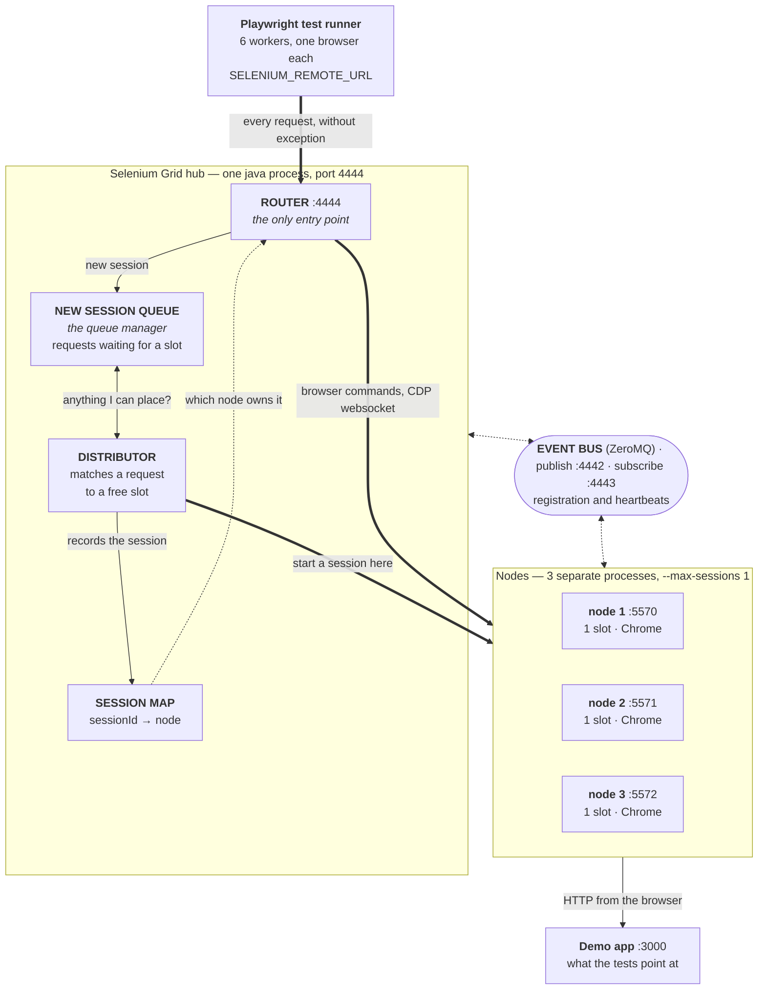
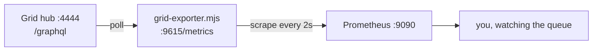
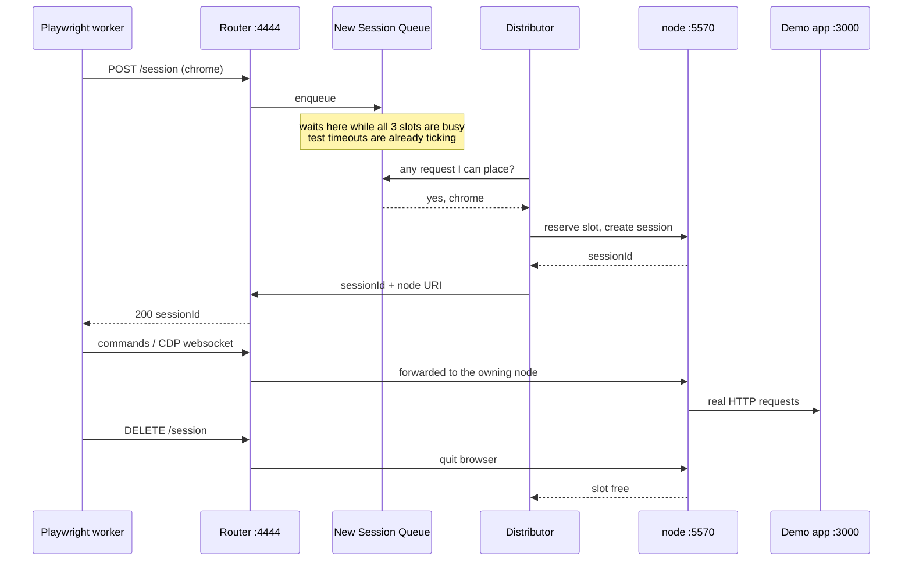

# What a Selenium Grid actually is

The picture to have in your head for the next 60 minutes. Three things matter:
there is **one door in**, there is **a queue behind that door**, and there are
**three nodes** that do the actual work.

Everything below runs on your own laptop.

---

## The whole rig



Read the hub box in order: a request arrives at the **Router**, waits in the
**New Session Queue**, gets placed on a node by the **Distributor**, and the
**Session Map** remembers which node owns it so later commands can be
forwarded. One session end to end, step by step, is
[at the bottom of this page](#one-session-end-to-end).

If Mermaid does not render where you are reading this, the same thing in ASCII:

```
     Playwright test runner, 6 workers
                    │  SELENIUM_REMOTE_URL
                    ▼
  ┌─────────────────────────────────────────────┐
  │  hub :4444   one java process               │
  │                                             │
  │       ROUTER  ── the only door in           │
  │          │                                  │
  │          ▼                                  │
  │  NEW SESSION QUEUE  ── the waiting room     │
  │          │                                  │
  │          ▼                                  │
  │     DISTRIBUTOR  ───▶  SESSION MAP          │
  └──────┬───────────┬───────────┬──────────────┘
         │           │           │
    ┌────▼────┐ ┌────▼────┐ ┌────▼────┐     event bus
    │ node 1  │ │ node 2  │ │ node 3  │ ◄── :4442 / :4443
    │ :5570   │ │ :5571   │ │ :5572   │
    │ 1 slot  │ │ 1 slot  │ │ 1 slot  │
    └────┬────┘ └─────────┘ └─────────┘
         │
         ▼
    demo app :3000
```

---

## The single entry point

Everything the test runner says goes to `http://localhost:4444`, and nothing
ever talks to a node directly. That is the Router's job, and it is the reason a
grid is useful at all: the runner needs to know one address, and where the
browser actually runs stops being the test's problem.

The Router does exactly two things with what arrives:

- **A new session request** — it hands it to the New Session Queue and waits.
  It does not choose a node. It does not know what is free.
- **Anything with a session id** — it looks the id up in the Session Map, finds
  which node owns that session, and forwards the command there.

In our rig the Router, queue, Distributor and Session Map are all one `java`
process, because we start the Grid in hub mode. In production they can be four
separate deployments behind the same port. Same responsibilities either way,
which is why the concepts transfer even though our whole grid is a laptop.

> Playwright's one wrinkle: after the session exists it attaches to Chrome over
> a **CDP websocket** whose address comes from the node's `--grid-url`. That is
> why our nodes advertise `http://localhost:4444` — so even that connection
> comes back through the front door.

---

## The queue manager

The **New Session Queue** is the component the workshop is really about, so it
is worth naming properly rather than calling it "the grid being busy".

A request lands in the queue and sits there until the Distributor can match it
to a free slot. While it sits there:

- **The runner is not told anything.** No "queued" status, no callback. From
  Playwright's side the session request simply has not returned yet.
- **Your test timeouts are already running.** Nothing in the queue is deducted
  from them. A test that waited 40 seconds for a slot gets the same 30-second
  action timeout as a test that got a slot instantly.
- **Order is not a promise.** The Distributor matches on capabilities, so a
  request that wants something available can overtake one that is waiting for a
  busy slot type.

We have **3 slots** — 3 nodes × `--max-sessions 1` — and we run the suite with
**6 workers**. That arithmetic guarantees a queue on everybody's hardware
regardless of how fast their laptop is, which is the whole point of pinning
`--max-sessions`. Left at its default, a node advertises one slot per CPU core,
so "three nodes" on an 8-core machine would be 24 slots and nothing would ever
wait.

This is the number to watch during the run:

```promql
selenium_grid_session_queue_size
```

Full query list in [METRICS.md](./METRICS.md).

---

## The nodes

A node is the thing that owns browsers. It registers itself with the hub over
the **event bus** (ZeroMQ, `:4442` publish / `:4443` subscribe — not HTTP),
advertises stereotypes describing what it can run, then heartbeats for as long
as it lives. Kill a node and the hub finds out through that bus, not through a
failed request.

Ours are deliberately boring: one slot, Chrome only, `chromedriver` fetched
automatically by Selenium Manager to match your installed Chrome.

| | node 1 | node 2 | node 3 |
|---|---|---|---|
| Port | 5570 | 5571 | 5572 |
| Slots | 1 | 1 | 1 |
| Browser | Chrome | Chrome | Chrome |

Ports are not Selenium's default `5555` on purpose: that is also ADB's default,
so anyone with an Android emulator open would collide. All of them come from
[`config/versions.json`](../config/versions.json).

**Say this part out loud:** these three nodes are three *separate processes on
one machine*, simulating three machines. Registration, distribution and queuing
behave exactly as they do in production — but they share one laptop's CPU, RAM
and disk. Nobody should leave thinking they built a real cluster.

---

## Where the numbers come from

The Grid has no `/metrics` endpoint. It has a **GraphQL API** on the same port
`4444`, and `tools/grid-exporter.mjs` polls it and republishes it in Prometheus
format.



Ask the Grid yourself — this is the same data the graphs are built from:

```bash
curl -s -X POST http://localhost:4444/graphql \
  -H 'Content-Type: application/json' \
  --data '{"query":"{ grid { nodeCount, totalSlots, sessionCount, maxSession, sessionQueueSize } }"}'
```

```json
{"data":{"grid":{"nodeCount":3,"totalSlots":3,"sessionCount":0,"maxSession":3,"sessionQueueSize":0}}}
```

---

## One session, end to end



The step that never appears in your test report is the `Note`. That is the
whole workshop: your suite spent time in a queue it cannot see, and no timeout,
retry count or trace tells you so.

---

## Ports, in one table

| Port | What | Who talks to it |
|---|---|---|
| 4444 | Hub: Router, `/ui`, `/status`, `/graphql` | test runner, exporter, you |
| 4442 / 4443 | Event bus, publish / subscribe | hub and nodes only |
| 5570 / 5571 / 5572 | Nodes | the hub |
| 3000 | Demo app | the browsers |
| 9615 | Exporter `/metrics` | Prometheus |
| 9090 | Prometheus | you |

Useful views while the suite runs: the Grid console at
<http://localhost:4444/ui> shows slots going busy, and Prometheus at
<http://localhost:9090> shows the queue behind them.
